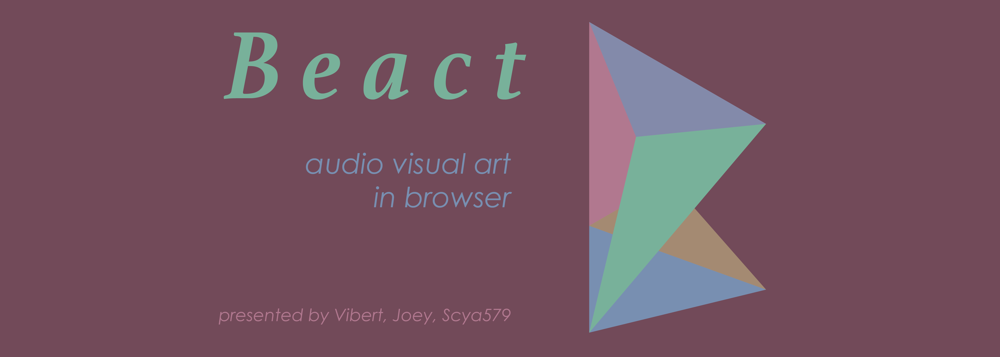
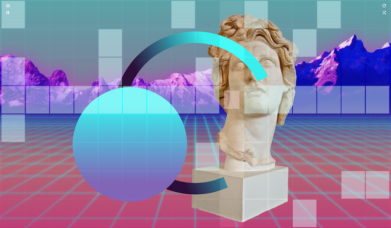
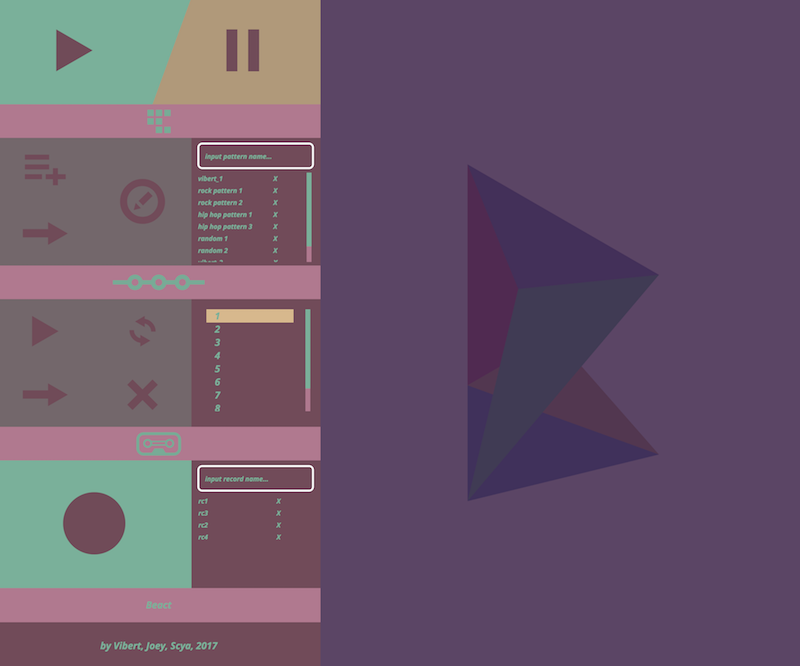

# [Beact](https://beact.herokuapp.com/) &middot; [](http://makeapullrequest.com)

> 🎸🎨 DJ / VJ all by yourself in seconds !
- [demo](https://beact.herokuapp.com/) - It's deployed on Heroku, play it now!
- [video](https://vimeo.com/226318485) - Short video of using Beact for performance!
- [blog(vibert)](https://medium.com/@vibertthio/beact-audio-visual-art-in-react-44e9c757e40f) - vibert's words after creating Beact!
- [english version](https://medium.com/@vibertthio/dj-and-vj-all-by-yourself-in-seconds-on-web-e5befc162e0f) - vibert's words after creating Beact!
- [blog(scya)](http://scyablog.blogspot.tw/2017/07/beact.html) - scya597's words after creating Beact! (only mandarin now, english coming)

An audio/visual interactive art piece, and an instrument that everyone play with to become a DJ + VJ.
It's based on the idea of patatap, and using two.js, tone.js as audio and visual library.
It combines sequencer with on concept of patatap.
I have added some my own animation and will do more to replace ones from patatap.


## 0. Table of Contents  
- [Quick Start](#1-quick-start)
- [Run on Local](#2-run-on-local)
- [Development](#3-development)
- [Deploy](#4-deploy)
- [Basic Usage](#5-basic-usage)
- [Advanced Usage](#6-ui-and-advanced-usage)
- [Credits and Inpirations](#7-credits-and-inspirations)


## 1. Quick Start
1.   open the [demo](https://safe-stream-69256.herokuapp.com/) link.
2.   press space to start/stop.
3.   click any block to trigger drum machine note.
4.   press any alphabet to trigger keyboard note.
5.   up/down to change bpm.
6.   left/right to change sound bank of drum machine.
7.   press 1 ~ 8 for different presets.
8.   shift+up/down to change animations of keyboard.
9.   shift+left/right to change animations of drum machine.
10.   press naruto icon to set naruto animation of keyboard.



## 2. Run on Local
> It's okay to run Beact without server. It will git some error in console irrelevant, though.

First, clone the repo and install dependencies.  
Then **Rock'n Roll**, baanngg.

```
git clone https://github.com/vibertthio/beact beact
cd beact
npm install
npm run build
npm run start
```

## 3. Development
> Run Beact with server, giving you **the Force**.

### 3.1 To install mongodb

```
brew install mongo
```


### 3.2 Initial config of mongodb

Create database directory

```
sudo mkdir -p /data/db
```

Find your username

```
whoami
```

Taking ownership to /data/db

```
// assume your username is John
sudo chown -Rv John /data/db
```


### 3.3 To run the database

```
mongod
```

If you don't want to run mongod everytime you need, the following command will automatically start your database while the computer is running:

```
brew services start mongo
```


### 3.4 To develop Beact

```
npm run dev
```

## 4. Deploy
> We are using great Heroku for current deploy.

### 4.1 Clone the repo, install dependencies, and build.

```
git clone https://github.com/vibertthio/beact Beact
cd Beact
npm install
npm run build
```

### 4.2 Delete /public in "Ignore build files" of .gitignore

```
# Ignore build files
public << (delete)
```

### 4.3 Deploy

```
heroku create
heroku addons:create mongolab:sandbox
npm run deploy
```

## 5. Basic Usage

### 5.1 Keyboard & Sequencer Pads
1. click on the drum pad to make your own pattern.
2. press space to start/stop.
3. press up/down for bpm changing.
4. left/right to change sound samples.
5. press 1~8 to trigger preset patterns.
6. press a~z to trigger animation and audio just like patatap.

### 5.2 Sidebars
1. Start / Stop
2. Pattern : create a pattern, type in the name, and press add to upload yours to server and store.
3. Chain：chain few patterns into a song.
4. Recorder：record the drum machine pattern and keyboard together into a recording, and upload to server for you to share and replay.


## 6. UI and Advanced Usage

  
[Full User Guide](https://safe-stream-69256.herokuapp.com/)

## 7. Credits and Inspirations
  * crazi ass library [tone.js](https://tonejs.github.io/) and [two.js](https://two.js.org/)
  * original idea from amazing [patatap](http://patatap.com/)
  * music samples from amazing [stepkit](http://jxnblk.com/stepkit/)
